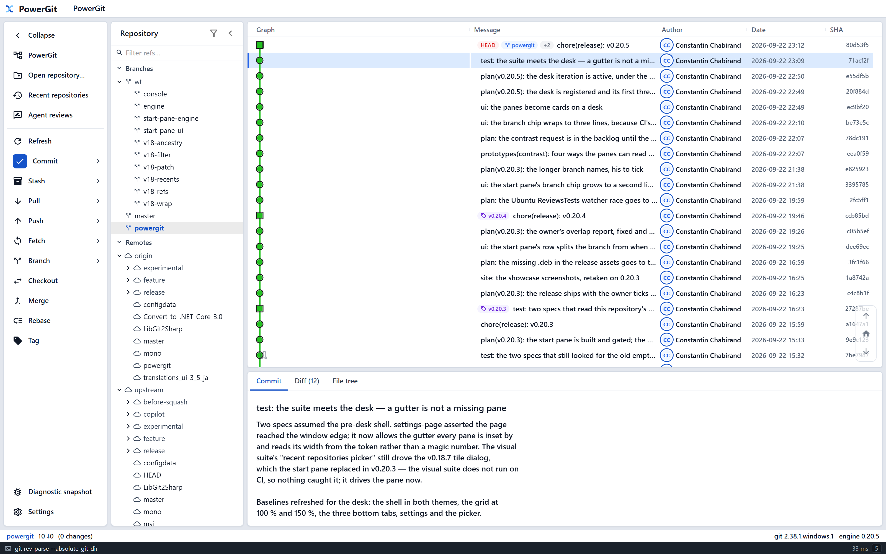

# PowerGit

**A new frontend for [Git Extensions](https://github.com/gitextensions/gitextensions) — modern, portable, cross-platform.**

PowerGit keeps everything that makes Git Extensions great — especially its
revision graph — and rebuilds the way it looks and feels: a React + Material UI
running in a lightweight Tauri shell, talking to a self-contained C# git engine.

> **Scope of this fork:** we are building a *new frontend*, not rewriting git
> plumbing. The proven Git Extensions engine code stays as the behavioral
> reference; the WinForms app remains in-tree untouched for exactly that
> reason. Today the product is the **Browse experience** (revision graph,
> commit details, diffs, staging, branches, stashes). More surfaces follow.

## Why

| | Git Extensions (WinForms) | PowerGit |
|---|---|---|
| UI toolkit | Windows Forms | React + Material, Tauri shell |
| Platform | Windows only | Windows today, Linux target |
| Install | Heavy installer | Portable zip — one exe + one sidecar |
| Graph | The gold standard | Same lanes & colors, virtualized |

## Highlights

- **The graph, always complete** — all branches, all tags, stashes as nodes;
  Git Extensions lane colors; smooth up to thousands of commits.
- **Everything in reach** — commit details, changed files, the full repo tree
  at any revision, unified diffs with context/full-file/whitespace options.
- **Real staging** — FormCommit-style window: unstaged │ staged │ diff │
  message, multi-select, right-click stage/delete/gitignore (with preview).
- **Branch operations with GE guards** — checkout, reset, rebase from the
  graph's right-click menu; manage remotes, tags and submodules from the tree.
- **Self-sufficient packaging** — the app spawns its own .NET 10 engine
  sidecar; no prerequisites on the machine.

<p align="center">
  
</p>

More screenshots and an interactive live demo:
**[cynacons.github.io/PowerGit](https://cynacons.github.io/PowerGit/)**

## Status & roadmap

Tracked openly in [PLAN.md](PLAN.md). Shipped: v0.6.0 (Browse product +
release pipeline + Pages showcase). Parked: fetch/pull/push buttons, dark
theme, worktrees.

## Development

Windows dev machine; .NET 10 SDK, Node 22, Rust.

```bash
# engine tests
dotnet test src/engine/PowerGit.Engine.sln

# UI dev server (+ engine)
cd frontend && npm ci && npm run dev:all

# headless proof
npm run test:e2e          # functional
npm run test:resolution   # layout at 5 viewports up to 4K fullscreen

# packaged Windows artifacts into dist/
pwsh scripts/package-windows.ps1
```

All git I/O goes through the engine (`http://127.0.0.1:7733`); the UI never
shells out to git. Agent guidance lives in [AGENTS.md](AGENTS.md); requirements
in [docs/srs](docs/srs/README.md).

## Releases

Tags trigger CI builds for Windows (portable zip + installer) and Linux
(AppImage + deb): see the
[releases page](https://github.com/CynaCons/PowerGit/releases).

## License

GPL-3.0 — PowerGit is a combined work with Git Extensions.
See [LICENSE.md](LICENSE.md).
